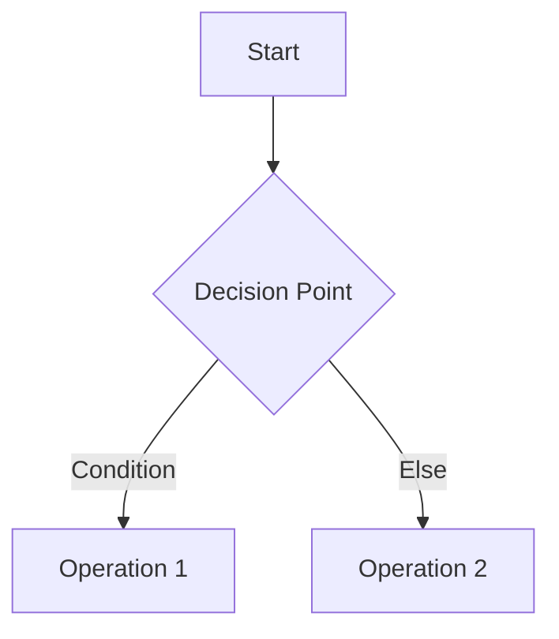

# MergeTwoSortedList

**Created**: 2025-06-15 at 17:58:48
**Related**: [[]]
**Tags**: #programming

## Problem Statement

```plaintext
You are given the heads of two sorted linked lists list1 and list2.

Merge the two lists into one sorted list.
The list should be made by splicing together the nodes of the first two lists.

Return the head of the merged linked list.
```

## Approach

```text
<Explain your high-level strategy>
```

### Key Insights

1.
2.
3.

## Solution

```<language>
<Insert solution code here>
```

### Complexity Analysis

- **Time**: O() -
- **Space**: O() -

## Explanation



<Detailed explanation of solution>

## References

1. []()

---

## Follow-up Questions

1.
2.

## Variations

```<language>
<Alternative implementations>
```

## Test Cases
