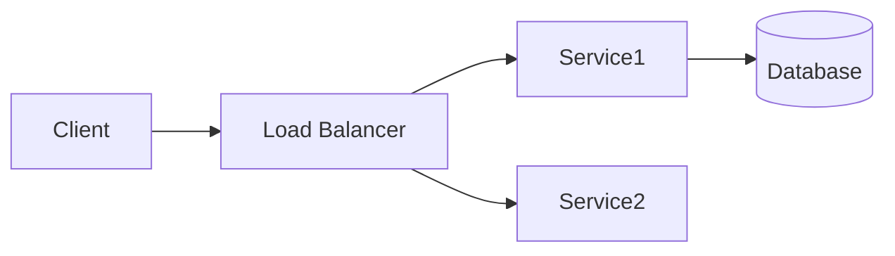
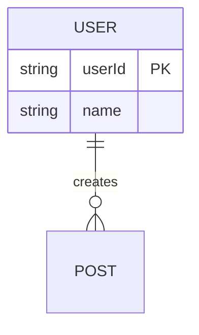

# {{title}}

**Created**: {{date}}
**Scale**: <expected QPS/users>
**Tags**: #system-design #architecture

## Requirements

1. **Functional**:
   -
2. **Non-Functional**:
   -

## Capacity Estimation

- **Traffic**:
- **Storage**:
- **Bandwidth**:

## High-Level Design



## Components Deep Dive

### 1. <Component Name>

- **Responsibility**:
- **Interface**:

```proto
service ComponentName {
    rpc Method(Request) returns (Response);
}
```

## Data Storage



## Tradeoffs

| Option | Pros | Cons |
| ------ | ---- | ---- |
|        |      |      |
