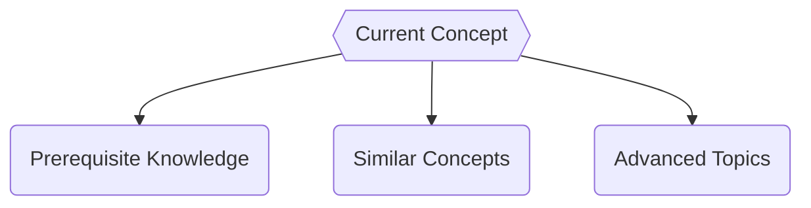

# {{title}}

**Concept Type**:: #`<programming-language/framework/theory>`
**Mastery Level**:: `🧠 Familiar | ⚙️ Working | 🚀 Proficient | 🔬 Expert`
**Date Started**:: {{date}}
**Last Revised**::
**Related**:: [[]]
**Tags**::

## Core Concept

> _Briefly explain what it is in 1-2 sentences_

## Why Important?

-
-

## How It Works

## Core Mechanics

```<language>
// Basic syntax/pattern
function example(param) {
    return transformed(param);
}
```

### Key Parameters

- `param`:
- `return`:

## Practical Examples

### Basic Usage

```<language>
// Minimal implementation
const result = basicUsage(input);
```

### Real-World Scenario

```<language>
// Production-ready pattern
function optimizedSolution(data) {
    // Explain optimizations
}
```

## Common Pitfalls

```<language>
// Anti-pattern example
function badPractice() {
    🚫 // Why this is wrong
}
```

🛑 **Why to Avoid:**

## Mental Models

```mermaid
mindmap
  root(({{title}}))
    Core Principles
      Principle 1
      Principle 2
    Application Patterns
      Pattern A
      Pattern B
```

## Practice Exercises

1. **Basic**:
   ```<language>
   // Starter code
   function exercise1(input) {
       // Implement solution
   }
   ```
2. **Intermediate**:
   ```<language>
   // Challenge scaffold
   function exercise2(data) {
       // Optimize this
   }
   ```

## Resources

1. [Official Documentation]()
2. [Key Tutorial]()
3. [Deep Dive Article]()
4. [Practice Platform]()

## Concept Connections



## Recall Triggers

- Mnemonic:
- Visualization:
- Analogy:
