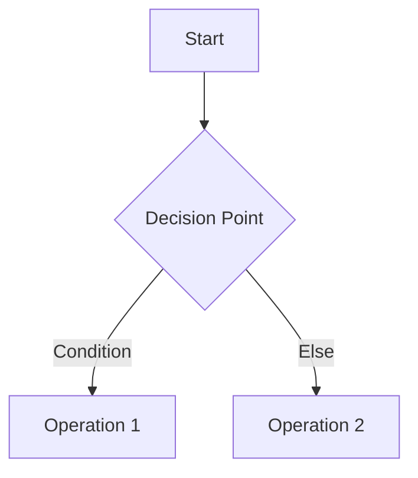

# {{title}}

**Created**: {{date}} at {{time}}
**Related**: [[]]
**Tags**: #programming

## Problem Statement

```plaintext
<Describe the problem here>
```

## Approach

```text
<Explain your high-level strategy>
```

### Key Insights

1.
2.
3.

## Solution

```<language>
<Insert solution code here>
```

### Complexity Analysis

- **Time**: O() -
- **Space**: O() -

## Explanation



<Detailed explanation of solution>

## References

1. []()

---

## Follow-up Questions

1.
2.

## Variations

```<language>
<Alternative implementations>
```

## Test Cases
