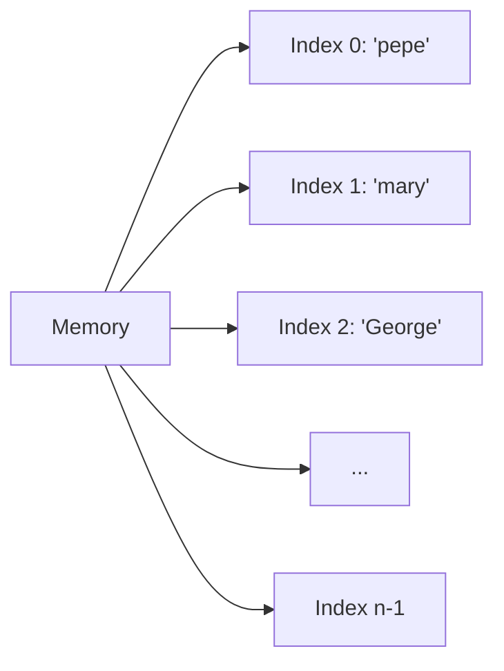
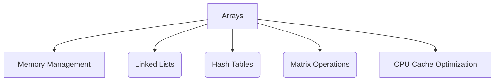

# Array

**Concept Type**:: #DataStructure
**Mastery Level**:: `🚀 Proficient`
**Date Started**:: 2025-05-31
**Last Revised**::
**Related**:: [[Basic Data Structures]]
**Tags**:: #array #memory #traversal #search #insertion #deletion

## Core Concept

> An array is a collection of elements stored contiguously in memory, accessible via indices.
> It provides O(1) access to elements by index but has fixed size in static implementations.

## Why Important?

- Foundation for complex data structures
- Memory-efficient for sequential data
- Enables fast random access
- Used in low-level system programming

## How It Works

Arrays allocate a continuous block of memory. Each element occupies fixed-size slots, with indices calculated as:  
`memory_address = base_address + index * element_size`

## Core Mechanics

```c
// C array declaration
int numbers[5] = {10, 20, 30, 40, 50};
```

### Key Parameters

- **Index**: Position of element (0-based)
- **Element**: Value stored at memory location
- **Length**: Number of elements (fixed or dynamic)

## Practical Examples

### Basic Usage

```javascript
// JavaScript dynamic array
const fruits = ["Apple", "Banana", "Cherry"];
console.log(fruits[1]); // Output: Banana
```

### Real-World Scenario

```python
# Temperature monitoring system
temperatures = [22.5, 23.1, 21.8, 24.3]  # Hourly readings

# Calculate average
avg = sum(temperatures) / len(temperatures)
print(f"Average temp: {avg:.1f}°C")
```

## Common Pitfalls

```javascript
// Out-of-bound access
const arr = [1, 2, 3];
console.log(arr[5]); // Returns undefined (JavaScript)
// C/C++ would cause segmentation fault
```

🛑 **Why to Avoid:**  
Memory corruption, security vulnerabilities, and unpredictable behavior. Always validate indices.

## Mental Models

```mermaid
mindmap
  root((Arrays))
    Core Principles
      Contiguous Memory
      O(1) Random Access
      Fixed/Dynamic Size
    Application Patterns
      Buffer Storage
      Matrix Operations
      Lookup Tables
    Performance
      Fast Read
      Slow Insert/Delete
```

## Practice Exercises

1. **Basic**:

   ```javascript
   // Reverse an array in-place
   function reverseArray(arr) {
     // Your implementation
   }
   ```

2. **Intermediate**:
   ```python
   # Implement binary search
   def binary_search(arr, target):
       left, right = 0, len(arr) - 1
       while left <= right:
           mid = (left + right) // 2
           # Complete the algorithm
   ```

## Memory Representation



## Types of Arrays

| Classification | Types        | Use Case                     |
| -------------- | ------------ | ---------------------------- |
| **Size**       | Fixed-length | Embedded systems, buffers    |
|                | Dynamic-size | Collections, data processing |
| **Dimensions** | 1D (Vector)  | Simple lists                 |
|                | 2D (Matrix)  | Grids, images                |
|                | ND (Tensor)  | Machine learning             |

## Key Operations

### Traversal

```python
# Linear traversal (Python)
for i in range(len(arr)):
    print(arr[i])

# Reverse traversal
for i in range(len(arr)-1, -1, -1):
    print(arr[i])
```

### Insertion

```java
// Insert at index (Java-like pseudocode)
void insert(int[] arr, int index, int value) {
    // Shift elements right
    for (int i = arr.length-1; i > index; i--) {
        arr[i] = arr[i-1];
    }
    arr[index] = value;
}
```

### Deletion

```c
// Delete at index (C-like pseudocode)
void delete(int arr[], int index, int size) {
    // Shift elements left
    for (int i = index; i < size-1; i++) {
        arr[i] = arr[i+1];
    }
    arr[size-1] = 0;  // Clear last element
}
```

### Searching

```python
# Linear Search (O(n))
def linear_search(arr, target):
    for i in range(len(arr)):
        if arr[i] == target:
            return i
    return -1

# Binary Search (O(log n)) - Requires sorted array
def binary_search(arr, target):
    low, high = 0, len(arr)-1
    while low <= high:
        mid = (low + high) // 2
        if arr[mid] == target:
            return mid
        elif arr[mid] < target:
            low = mid + 1
        else:
            high = mid - 1
    return -1
```

## Concept Connections



## Recall Triggers

- Mnemonic: "**A**ll **R**esources **R**eside **A**djacent" (ARRA)
- Visualization: Bookshelf with numbered slots
- Analogy: Apartment building with numbered units

## Resources

1. [Array Data Structure Guide](https://www.geeksforgeeks.org/array-data-structure-guide/)
2. [Visualizing Array Memory Layout](https://pythontutor.com/)
3. [Array Complexity Analysis](https://www.bigocheatsheet.com/)
4. [Practice: Leetcode Array Problems](https://leetcode.com/tag/array/)
