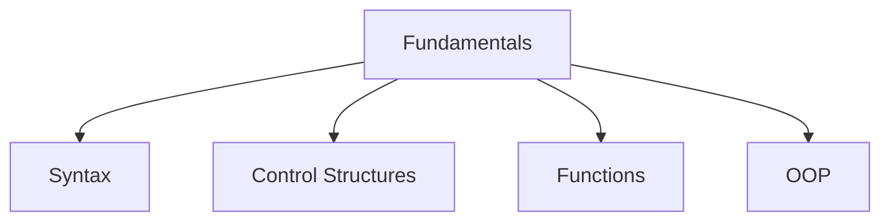
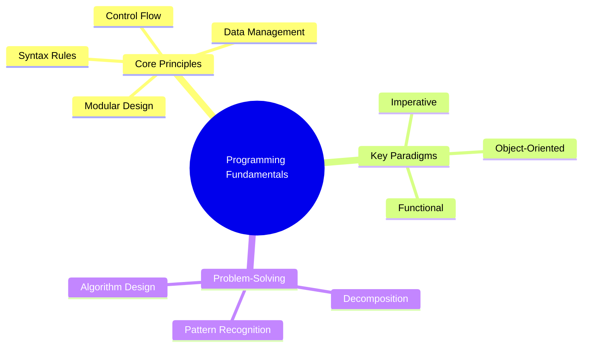
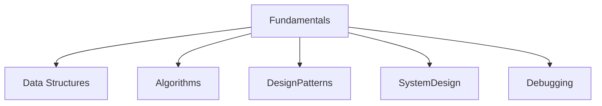

# Core

**Concept Type**::#fundamentals
**Mastery Level**:: `🧠 Familiar `
**Date Started**:: 2025-05-31
**Last Revised**::
**Related**:: [[Data Structures]]
**Tags**:: #syntax #control-flow #functions #oop

## Core Concept

> Programming fundamentals are the foundational concepts that enable developers to write efficient, maintainable code.
> They include syntax rules, control flow mechanisms, function design, and object-oriented principles that form the basis of all software development.

## Why Important?

- Essential for understanding any programming language
- Enables efficient problem-solving
- Forms basis for advanced concepts
- Improves code quality and maintainability
- Critical for technical interviews

## How It Works

Programming fundamentals provide the building blocks for software development. By mastering these core concepts,
developers can create logical, efficient solutions to complex problems regardless of the specific programming language used.



## Core Mechanics

### Language Syntax

```javascript
// JavaScript variable declaration
let message = "Hello World"; // String variable
const PI = 3.14; // Constant
console.log(message); // Built-in function
```

### Control Structures

```python
# Python control structures
age = 20

# Selection (if-else)
if age >= 18:
    print("Adult")
else:
    print("Minor")

# Iteration (for loop)
for i in range(5):
    print(f"Count: {i}")
```

### Functions

```java
// Java function example
public int addNumbers(int a, int b) {
    return a + b;  // Returns sum
}

// Higher-order function
public void processNumbers(Function<Integer, Integer> operation) {
    int result = operation.apply(5);
    System.out.println(result);
}
```

### OOP Principles

```csharp
// C# class demonstrating OOP
public class Animal {
    // Encapsulation
    private string name;

    public Animal(string name) {
        this.name = name;
    }

    // Polymorphism
    public virtual void Speak() {
        Console.WriteLine("Animal sound");
    }
}

public class Dog : Animal {
    // Inheritance
    public Dog(string name) : base(name) {}

    // Polymorphism
    public override void Speak() {
        Console.WriteLine("Woof!");
    }
}
```

## Practical Examples

### Real-World Function

```javascript
// E-commerce cart calculation
function calculateTotal(items, taxRate) {
  const subtotal = items.reduce((sum, item) => sum + item.price, 0);
  const tax = subtotal * taxRate;
  return subtotal + tax;
}
```

### OOP Implementation

```python
# Banking system
class Account:
    def __init__(self, account_number, balance=0):
        self.account_number = account_number
        self.__balance = balance  # Encapsulation

    def deposit(self, amount):
        if amount > 0:
            self.__balance += amount
            return True
        return False

    def get_balance(self):
        return self.__balance

class SavingsAccount(Account):  # Inheritance
    def __init__(self, account_number, balance=0, interest_rate=0.01):
        super().__init__(account_number, balance)
        self.interest_rate = interest_rate

    def apply_interest(self):
        self.__balance *= (1 + self.interest_rate)
```

## Common Pitfalls

```javascript
// Scope issues
function calculate() {
  if (true) {
    var x = 10; // Function-scoped
    let y = 20; // Block-scoped
  }
  console.log(x); // 10 (works)
  console.log(y); // ReferenceError: y is not defined
}
```

🛑 **Why to Avoid:**  
Misunderstanding scope leads to bugs that are hard to trace. Always use `const` and `let` for block scoping.

## Mental Models



## Practice Exercises

1. **Basic**:

   ```python
   # FizzBuzz Problem
   for i in range(1, 101):
       output = ""
       if i % 3 == 0: output += "Fizz"
       if i % 5 == 0: output += "Buzz"
       print(output or i)
   ```

2. **Intermediate**:

   ```java
   // Bank Account OOP Exercise
   public class BankAccount {
       private double balance;

       public BankAccount(double initialBalance) {
           // Implement constructor
       }

       public void deposit(double amount) {
           // Add validation
       }

       public void withdraw(double amount) {
           // Prevent overdraft
       }
   }
   ```

## Concept Connections



## Recall Triggers

- Mnemonic: "**S**tructured **C**ode **F**unctions **O**bjectively" (SCFO)
- Visualization: Flowchart showing program execution
- Analogy: Building construction (blueprint = syntax, plumbing = control flow)

## Resources

1. [Comprehensive Roadmap](https://roadmap.sh/)
2. [FreeCodeCamp Curriculum](https://www.freecodecamp.org/learn)
3. [Visualizing Code Execution](https://pythontutor.com/)
4. [Practice: Codewars Fundamentals](https://www.codewars.com/)
