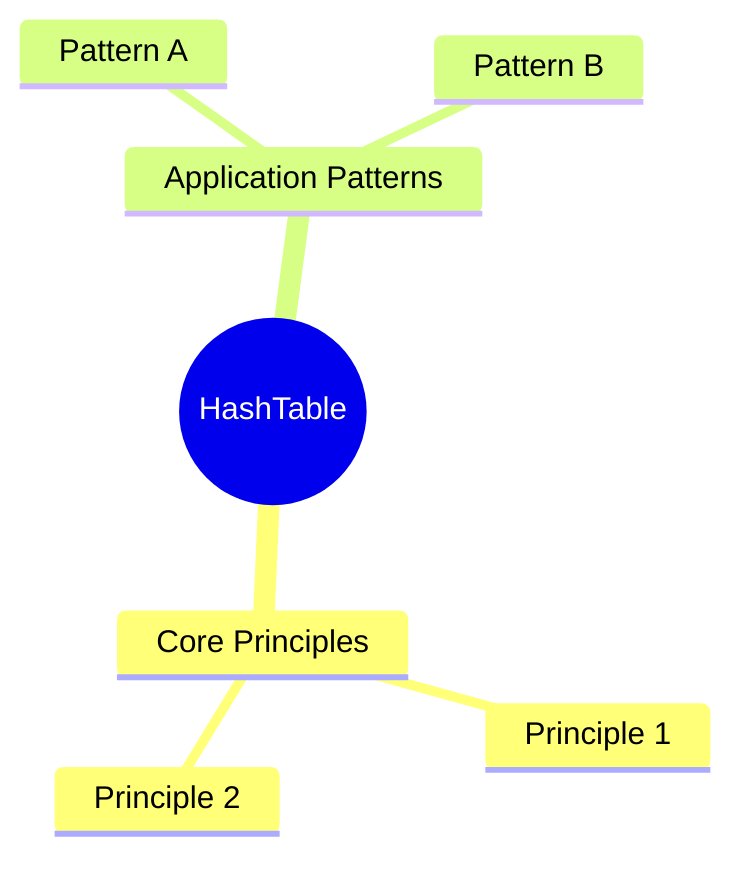
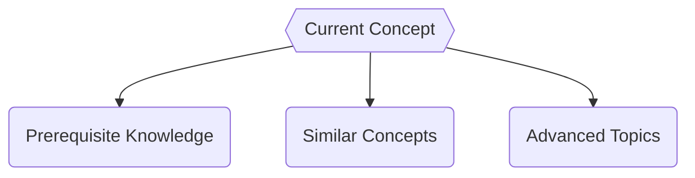

# HashTable

**Concept Type**:: #fundamentals #DataStructure
**Mastery Level**:: `🧠 Familiar`
**Date Started**:: 2025-06-21
**Last Revised**::
**Related**:: [[Core]]
**Tags**:: #object

## Core Concept

> _is a data structure that allow fast searching data based of a keys_

## Why Important?

- Store data in o(1) and access the data in o(1).
- Key-value Support: Hashing is ideal for implementing key-value data structures.
- Fast data retrieval: Hashing allows for quick access to elementens with constant time complexity
- Efficiency: Insertion, deletion, and searching operations are highly efficient
- Memory usage reduction: Hashin require less memory as it allocates a fixed space for storing
  elementens
- Scalability: Hashing performs well with large data sets maitaining constant access time.
- Security and encryption: Hashing is essential for secure data storage and integrity verification.

## How It Works

## Core Mechanics

```<language>
// Basic syntax/pattern
function example(param) {
    return transformed(param);
}
```

### Key Parameters

- `param`:
- `return`:

## Practical Examples

### Basic Usage

```<language>
// Minimal implementation
const result = basicUsage(input);
```

### Real-World Scenario

```<language>
// Production-ready pattern
function optimizedSolution(data) {
    // Explain optimizations
}
```

## Common Pitfalls

```<language>
// Anti-pattern example
function badPractice() {
    🚫 // Why this is wrong
}
```

🛑 **Why to Avoid:**

## Mental Models



## Practice Exercises

1. **Basic**:
   ```<language>
   // Starter code
   function exercise1(input) {
       // Implement solution
   }
   ```
2. **Intermediate**:
   ```<language>
   // Challenge scaffold
   function exercise2(data) {
       // Optimize this
   }
   ```

## Resources

1. [Official Documentation]()
2. [Key Tutorial]()
3. [Deep Dive Article]()
4. [Practice Platform]()

## Concept Connections



## Recall Triggers

- Mnemonic:
- Visualization:
- Analogy:
