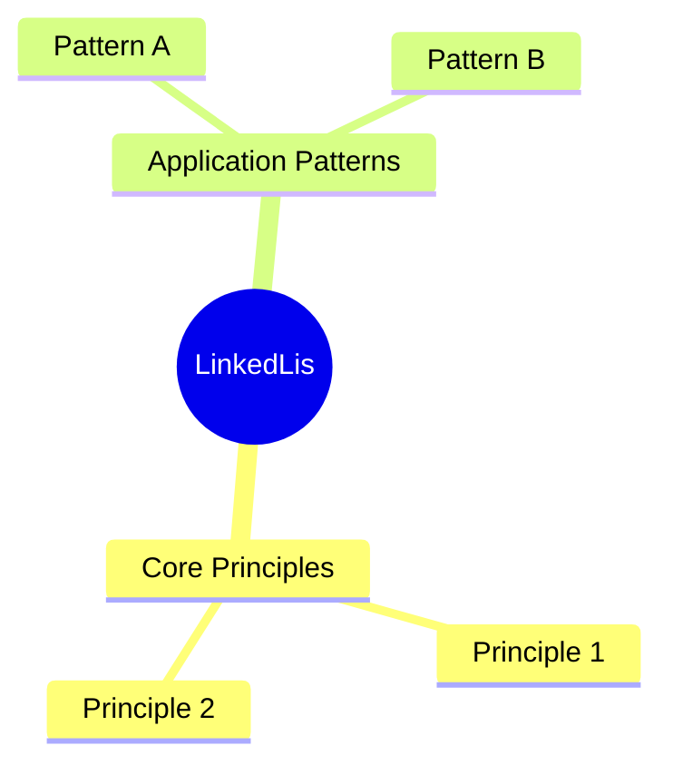
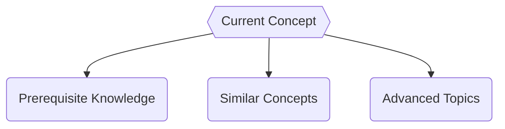

# LinkedLis

**Concept Type**:: #DataStructure #fundamentals
**Mastery Level**:: `⚙️ Working `
**Date Started**:: 2025-05-31
**Last Revised**::
**Related**:: [[Array|array]],[[Core|core]], [[SinglyLinkedList|singlyLinkedList]]
**Tags**:: #LinkedLists

## Core Concept

> is a data structure how allow you to make insertion and deletions in an efficient way.
> Entry point for stacks and qeue.

## Why Important?

- allows Insert and delete data in a efficient way,
- store memory in place
- entry point for stacks and qeue

## How It Works

Structure:

- Node
- Item
- Reference for the next node
- the first value is called Head
- the last value is called tail

# DIfference Between common Arrays

## LinkedLists

- Acces: Secuential
- Data Structure: no-Contiguous
- Inserting and Deleting Data: Exelent
- Memory: located in the nodes

## Arrays

- Acces: Random
- Data Structure: Contiguous
- Inserting and Deleting Data: Defficient
- Memory: Alocated in the whole Array

## Core Mechanics

```javaScript
// Basic syntax/pattern
class Node {
    constructor(data) {
        // Data of the Node
        this.data = data,

        //Pointer to the next value
        this.next = null
    }
}
class LinkedList {
    constructor(node) {
        //head is the first value of the linkedList
        this.head = new Node(node);

        //Tail is the last value of the Linkedlist

        this.tail = this.head;

        // The length of our linkedList

        this.length = 1;
    }
}
```

### Key Parameters

- `param`:
- `return`:

## Practical Examples

### Basic Usage

```<language>
// Minimal implementation
const result = basicUsage(input);
```

### Real-World Scenario

```<language>
// Production-ready pattern
function optimizedSolution(data) {
    // Explain optimizations
}
```

## Common Pitfalls

```<language>
// Anti-pattern example
function badPractice() {
    🚫 // Why this is wrong
}
```

🛑 **Why to Avoid:**

## Mental Models



## Practice Exercises

1. **Basic**:
   ```<language>
   // Starter code
   function exercise1(input) {
       // Implement solution
   }
   ```
2. **Intermediate**:
   ```<language>
   // Challenge scaffold
   function exercise2(data) {
       // Optimize this
   }
   ```

## Resources

1. [Official Documentation](https://www.geeksforgeeks.org/linked-list-data-structure/)
2. [Key Tutorial]()
3. [Deep Dive Article]()
4. [Practice Platform](https://leetcode.com/)

## Concept Connections



## Recall Triggers

- Mnemonic:
- Visualization:
- Analogy:
