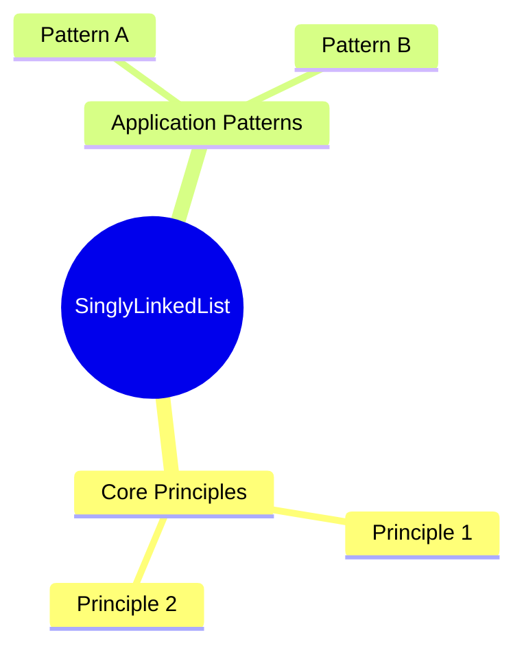
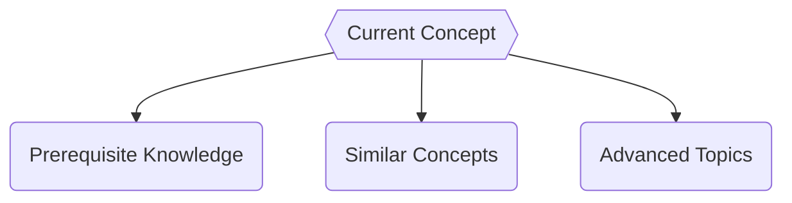

# SinglyLinkedList

**Concept Type**:: #DataStructure
**Mastery Level**:: `⚙️ Working`
**Date Started**:: 2025-06-01
**Last Revised**::
**Related**:: [[LinkedList|LinkedLis]],[[Array|array]]
**Tags**:: #core #fundamentals #LinkedLists

## Core Concept

> _is a fundamental data Structure where the node contains field of the data and a reference for the next node._

> _The next reference of the last node is always null._

## Why Important?

- Efficient Support for insertions
- Efficient Support for deletion

## How It Works

Each node have his data and a pointer ference for the next node this allow to chain dynamic linked Togheter, Making a chain of sequence.

## Core Mechanics

```javaScript
// Definition of a node
class Node {
    constructor(data) {
        // Data of the Node
        this.data = data,

        //Pointer to the next value
        this.next = null
    }
}
class LinkedList {
    constructor(node) {
        //head is the first value of the linkedList
        this.head = new Node(node);

        //Tail is the last value of the Linkedlist

        this.tail = this.head;

        // The length of our linkedList

        this.length = 1;
    }
}
const myLinkedList = new LinkedLists(1);
console.log(myLinkedList)
```

### Basic Usage

#### Traversal of Singly LinkedList

Meaning visit each node and make some operation like processing data or priting

#### Step by Step

1. Initialize a pointer (current) to the head of the list.
2. Loop through the list using a while loop until current becomes NULL.
3. Process each node (e.g., print its data).
4. Move to the next node by updating current = current->next.

> _Example_

```javaScript
class Node {
    constructor(data) {
        this.data = data;
        this.next = null;
    }
}

class LinkedList {
    constructor(node) {
        this.head = new Node(node);
        this.tail = this.head;
        this.length = 1;
    }

    push(data) {
        const newNode = new Node(data);
        if (!this.head) {
            this.head = newNode;
            this.tail = newNode;
        }
        this.tail.next = newNode;
        this.tail = newNode;
        this.length++;

        return newNode;
    }

    length() {
        return this.length;
    }
    traversal() {
        let current = this.head;

        while (current !==  null) {
            console.log(current.data)

            current = current.next;
        }
    }
}
```

#### Searching in singly LinkedList

> _is used for find an value or data in the LinkedList_

### Step by Step

1. start for the head of the linked List
2. look for the data in each node if exitst return true
3. otherwise return false
4. loop until found the data or you reach the tail.

> _Example_

```javaScript
    find(data) {
        let current = this.head;
        let response = false;
        while (current !== null) {
            if (current.data === data) response = true;

            current = current.next;
        }

        return response
    }
```

#### Finding the length in a singly Linked List

> _Use to retrieve the length of the LinkedList_

#### Step by Step

1. initialize a variable `length` in 0
2. loop throgugh the LinkedLists and increment for each node
3. loop until the current node is the tail
4. return the `length` variable

> _Example_

```javaScript
    length() {
        let length = 0;
        let current = this.head

        while (current !== null) {


            length++;
            current = current.next;
        }

        return length;
    }
```

#### Insertion in Syngly LinkedList

> _is one of the core options to use linkedList is the way of adding nodes to the LinkedList_

> _are several way to add nodes in the LinkedLists_

#### a. unshift in the LinkedLists

> _adding a node for the beggining of the linkedList_

#### Step by Step

1. Create a new Node
2. from the new node assign the reference to the current head
3. upload the head to the newest node
4. return the new Node

> _Example_

```javaScript
    unshift(data) {
        const newNode = new Node(data);
        newNode.next = this.head;
        this.head = newNode;

        return newNode;
    }
```

#### b. push in the LinkedList

> _adding a node at the end of the LinkedList_

#### steb by Step

1. Create a new Node
2. if the List dont have values make the newNode the head and tail
3. find the tail and assing is next value to the newNode
4. move the tail value to the newest Node

> _Example_

```javaScript
    push(data) {
        const newNode = new Node(data);
        if (!this.head) {
            this.head = newNode;
            this.tail = newNode;
        }

        this.tail.next = newNode;
        this.tail = newNode;
        return newNode;
    }
```

#### c. Insert an Specific Position of the singly LinkedList

> _add a node in the desire position using the length or the value searching_

#### Step by Step

1. Create a new node and assign it a value.

2. If inserting at the beginning (position = 1):
   Point the new node’s next to the current head.
   Update the head to the new node.
   Return (Insertion done).

3. Otherwise, traverse the list:
   Start from the head and move to the (position - 1)ᵗʰ node (just before the desired position).
   If the position is beyond the list length, return an error or append at the end.

4. Insert the new node:
   Point the new node’s next to the next node of the current position.
   Update the previous node’s next to the new node.

5. Return the updated list.

> _Example_

```javaScript
    insertForIndex(position,data) {
        const newNode = new Node(data);
        let length = 1;
        let current = this.head;
        if (position === length || position < length) {
            newNode.next = this.head;
            this.head = newNode;
            return newNode;
        }
        while (current !== null) {
            if (current.next === null && position - 1 > length ) {
                return console.error('the position is not in range');
            }
            if (length === position - 1) {
                let temp = current.next;
                current.next = newNode;
                newNode.next = temp;
            }
            length++;
            current = current.next;
        }
    }
```

### Real-World Scenario

```<language>
// Production-ready pattern
function optimizedSolution(data) {
    // Explain optimizations
}
```

## Common Pitfalls

```<language>
// Anti-pattern example
function badPractice() {
    🚫 // Why this is wrong
}
```

🛑 **Why to Avoid:**

## Mental Models



## Practice Exercises

1. **Basic**:
   ```<language>
   // Starter code
   function exercise1(input) {
       // Implement solution
   }
   ```
2. **Intermediate**:
   ```<language>
   // Challenge scaffold
   function exercise2(data) {
       // Optimize this
   }
   ```

## Resources

1. [Official Documentation](https://www.geeksforgeeks.org/singly-linked-list-tutorial/)
2. [Practice Platform](https://leetcode.com/)

## Concept Connections



## Recall Triggers

- Mnemonic:
- Visualization:
- Analogy:
