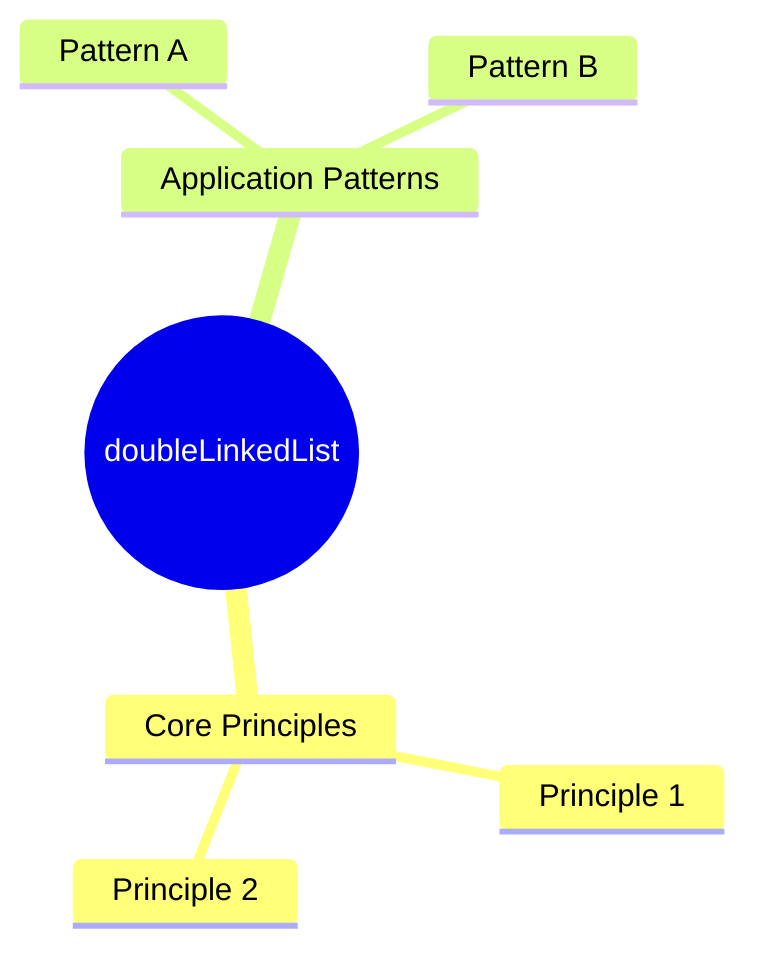

# doubleLinkedList

**Concept Type**:: #DataStructure
**Mastery Level**:: `⚙️ Working`
**Date Started**:: 2025-06-07
**Last Revised**::
**Related**:: [[LinkedList|LinkedLis]], [[Array]], [[SinglyLinkedList|singlyLinkedList]]
**Tags**:: #core #fundamentals #LinkedLists #doubleLinkedList

## Core Concept

> _a more complex data structure than singly LinkedList because allow better_

> _ways to insert and delete data adding pointer to prev nodes and next nodes_

> _allow better tranversal od the linked List for the same reason of the_

> _insertion and deletion, the pointer (prev and next)_

## Why Important?

- allow more efficient ways to tranversal arrays and use more complex algorithms
- better insetion and deletion of data

## How It Works

- each node have 3 imporant parts
  - a prev pointer for referece the previous node
  - the data of the node
  - a next pointer for reference to the next node

## Core Mechanics

```javaScript
class Node {

    constructor(data) {
        this.prev = null;
        this.data = data;
        this.next = null;
    }
}


class DoublyLinkedList {

    constructor() {
        this.head = null;
    }
}
```

#### adding data at the end of a DoublyLinkedList

> _method to add values at the end of the doubleLinkedList_

#### Step by Step

1. first Create a newNode in order to adding to the DoublyLinkedList
2. check if the doubleLinkedList LinkedList is empty if it:
   - add the new node as the head of the linkedList
3. create a variable called lastNode and store the current head.
4. traversal the linkedList in order to find the lastNode (tail).
5. add the pointer next of the lastNode to the newNode and the prev Pointer
   of newNode to the tail
6. return the newNode;

_Example_

```javaScript
    push(data) {
        const newNode = new Node(data);
        let lastNode = this.head;
        if (this.head === null) {
            this.head = newNode;
            return newNode;
        }
        while (lastNode.next !== null) {
            lastNode = lastNode.next;
        }
        lastNode.next = newNode;
        newNode.prev = lastNode;
        return newNode;
    }
```

#### traversal the doubleLinkedList

> _go throuhg the DoublyLinkedList and retrieve the data_

#### Step by Step

1. create a variable and store the first node
2. iterate through the DoublyLinkedList until we reach the last node.

_Example_

```javaScript
    traversal() {
        let current = this.head
        const arr = [];
        while (current !== null) {
            arr.push(current.data);
            current = current.next;
        }
        return arr;
    }
```

#### Reverse traversal the doubleLinkedList

> _go throuhg the DoublyLinkedList and retrieve the data using the prev_

#### Step by Step

1. create a variable and store the first node
2. iterate through the DoublyLinkedList until we reach the last node.
3. from the last node iterate one more time until the prev pointer === null

_Example_

```javaScript
    reverseTraversal() {
        let current = this.head;
        const arr = [];
        while (current.next !== null) {
            current = current.next;
        }
        while (current !== null) {
            arr.push(current.data);
            current = current.prev;
        }
        return arr;
    }
```

### Key Parameters

- `param`:
- `return`:

## Practical Examples

### Basic Usage

```<language>
// Minimal implementation
const result = basicUsage(input);
```

### Real-World Scenario

```<language>
// Production-ready pattern
function optimizedSolution(data) {
    // Explain optimizations
}
```

## Common Pitfalls

```<language>
// Anti-pattern example
function badPractice() {
    🚫 // Why this is wrong
}
```

🛑 **Why to Avoid:**

## Mental Models



## Practice Exercises

1. **Basic**:
   ```<language>
   // Starter code
   function exercise1(input) {
       // Implement solution
   }
   ```
2. **Intermediate**:
   ```<language>
   // Challenge scaffold
   function exercise2(data) {
       // Optimize this
   }
   ```

## Resources

1. [Official Documentation]()
2. [Key Tutorial]()
3. [Deep Dive Article]()
4. [Practice Platform]()

## Concept Connections

## Recall Triggers

- Mnemonic:
- Visualization:
- Analogy:
