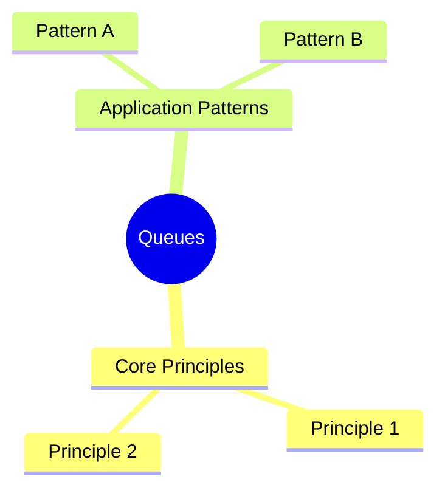
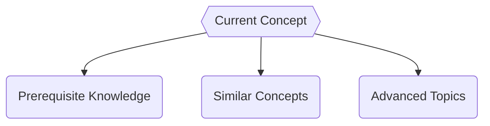

# Queues

**Concept Type**:: #DataStructure #fundamentals
**Mastery Level**:: `🧠 Familiar`
**Date Started**:: 2025-06-15
**Last Revised**::
**Related**:: [[Core|core]], [[Array|array]], [[LinkedList|linkedLis]]
**Tags**::#Queues #array #core

## Core Concept

> _ is a fundamental data structure for organize and access data_

## Why Important?

- use FIFO (First in First Out) for manage the data
- efficient way to get values in o(1) time complex

## How It Works

### implementation with Arrays

```javaScript
class Queue {
  constructor() {
    this.items = []
  }

  enqueue(item) {
    this.items.push(item);
  }

  dequeue() {
    if (!this.items) return 'the queue is empty'
  return this.items.pop();
  }

  peek() {
    return this.items[this.items.length - 1];
  }
  isEmpty() {
     return !this.items ? true  :  false;
  }
  size() {
    return this.items.length
  }

  clear() {
    return this.items.splice(0,this.items.this.size());
  }
  print() {

    return this.items.forEach(element => console.log(element));
  }
}


const queue = new Queue
queue.enqueue(0);
queue.enqueue(1);
queue.enqueue(2);
//console.log(queue.dequeue());
//console.log(queue.peek());
//console.log(queue.isEmpty());
//console.log(queue.size());
queue.print();
```

### implementations with linkedList

```javaScript
class Node {

  constructor(data) {
    this.data = data
    this.next = null
  }
}
class Queue {

  constructor() {
    this.rear = null
    this.front = null
    this.size = 0
  }


  enqueue(data) {
    const newNode = new Node(data);
    if (!this.rear) {
      this.rear = newNode;
      this.front = newNode;
    }
    this.rear.next = newNode;
    this.rear = newNode;
    this.size++;
  }
  dequeue() {
    if (!this.front) return null;
    if (!this.front.next) {
      const deletedNode = this.front;
      this.front = null;
      this.rear = null;
      this.size = 0;
      return deletedNode;
    }
    const deletedNode = this.front;
    this.front = this.front.next;
    this.size--;
    return deletedNode;
  }
  peek() {
    if (!this.front) return null;
    return this.front.data;
  }
  isEmpty() {
    return this.size <= 0
  }
  size() {
    return this.size;
  }
}


const myQueue = new Queue();
myQueue.enqueue(0);
myQueue.enqueue(1);
myQueue.enqueue(2);
myQueue.enqueue(3);
//console.log(myQueue);
//myQueue.dequeue();
//console.log(myQueue);
//console.log(myQueue.peek());
console.log(myQueue);
```

## Core Mechanics

```<language>
// Basic syntax/pattern
function example(param) {
    return transformed(param);
}
```

### Key Parameters

- `param`:
- `return`:

## Practical Examples

### Basic Usage

```<language>
// Minimal implementation
const result = basicUsage(input);
```

### Real-World Scenario

```<language>
// Production-ready pattern
function optimizedSolution(data) {
    // Explain optimizations
}
```

## Common Pitfalls

```<language>
// Anti-pattern example
function badPractice() {
    🚫 // Why this is wrong
}
```

🛑 **Why to Avoid:**

## Mental Models



## Practice Exercises

1. **Basic**:
   ```<language>
   // Starter code
   function exercise1(input) {
       // Implement solution
   }
   ```
2. **Intermediate**:
   ```<language>
   // Challenge scaffold
   function exercise2(data) {
       // Optimize this
   }
   ```

## Resources

1. [Official Documentation](https://www.geeksforgeeks.org/dsa/queue-data-structure/)
2. [Key Tutorial]()
3. [Deep Dive Article]()
4. [Practice Platform]()

## Concept Connections



## Recall Triggers

- Mnemonic:
- Visualization:
- Analogy:
