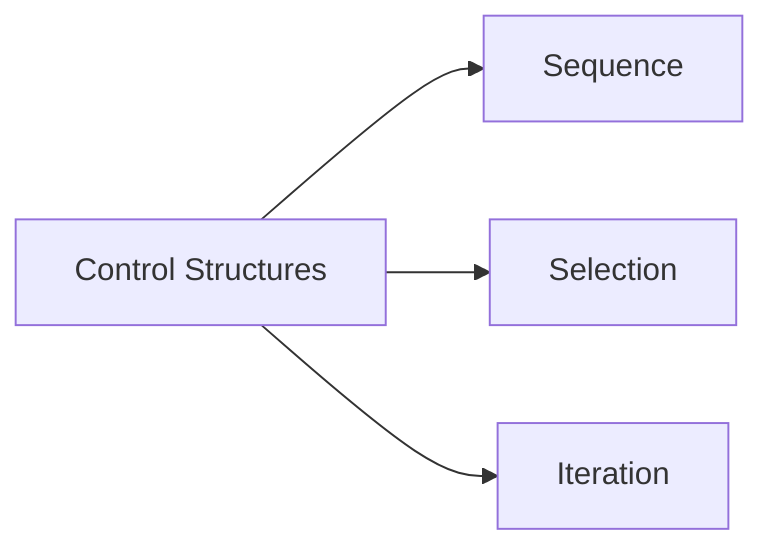
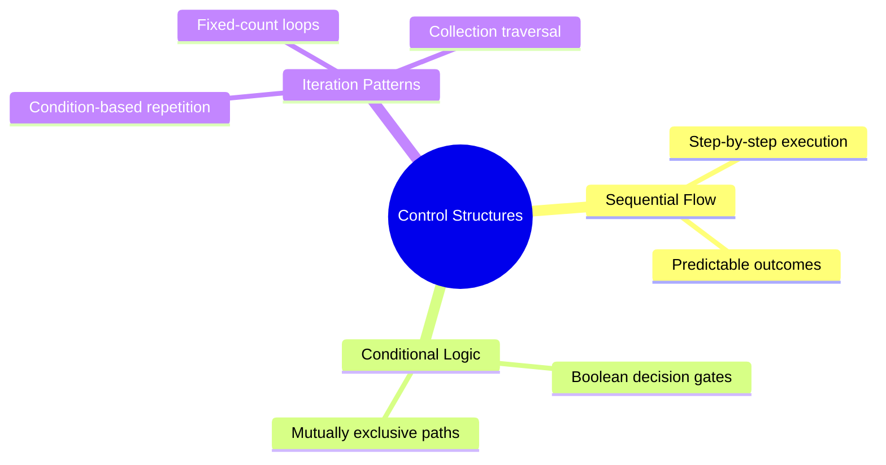
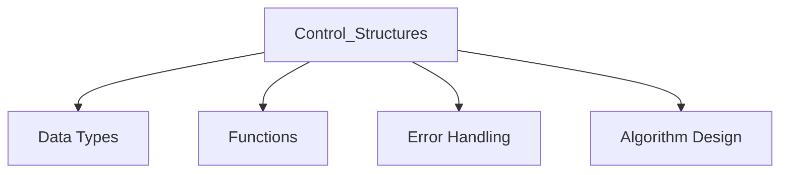

# Control_Structures

**Concept Type**:: #
**Mastery Level**:: `🧠 Familiar `
**Date Started**:: 2025-05-31
**Last Revised**::
**Related**:: [[Core|core]]
**Tags**:: #core #logic-flow #fundamentals

````markdown
## Core Concept

> Programming constructs that dictate program execution flow through sequential processing,

> conditional branching, and repetitive loops.

## Why Important?

- Determines logical flow of programs
- Enables decision-making capabilities
- Allows efficient task repetition
- Foundational for algorithm implementation

## How It Works

Manages instruction execution through three fundamental patterns:


````

## Core Mechanics

```javascript
// SEQUENTIAL FLOW (Default top-down execution)
const result = step1(input);
const final = step2(result);

// CONDITIONAL FLOW (Branching paths)
if (temperature > 30) {
  activateCooling();
} else if (temperature < 10) {
  activateHeating();
} else {
  maintainStatus();
}

// REPETITIVE FLOW (Looping)
for (let i = 0; i < 5; i++) {
  processItem(items[i]);
}

// Key Parameters:
// - Condition: Boolean expression controlling flow
// - Loop variables: Manage iteration cycles
// - Break/continue: Special flow control keywords
```

## Practical Examples

```javascript
// BASIC: Traffic Light Controller
function trafficLight(color) {
  if (color === "red") return "Stop";
  if (color === "yellow") return "Caution";
  return "Proceed"; // Green case
}

// REAL-WORLD: Login Attempt Limiter
function handleLogin(credentials) {
  let attempts = 0;
  while (attempts < 3) {
    if (validate(credentials)) return "Access granted";
    attempts++;
  }
  return "Too many failed attempts";
}
```

## Common Pitfalls

```javascript
// INFINITE LOOP (Missing exit condition)
while (true) { 🚫 // No termination logic
    processData();
}

// UNDEFINED BRANCH (Missing default case)
if (status === 'active') {
    enableFeatures();
} else if (status === 'inactive') {
    disableFeatures();
} // No handling for other statuses

🛑 Why to Avoid:
- Infinite loops crash applications
- Missing branches cause unpredictable behavior
- Both create debugging nightmares
```

## Mental Models



## Practice Exercises

```javascript
// BASIC: Grade Classifier
function assignGrade(score) {
  if (score >= 90) return "A";
  if (score >= 80) return "B";
  if (score >= 70) return "C";
  return "F";
}

// INTERMEDIATE: Password Strength Checker
function checkPasswordStrength(password) {
  let strength = 0;
  if (password.length >= 8) strength++;
  if (/[A-Z]/.test(password)) strength++;
  if (/[0-9]/.test(password)) strength++;
  if (/[!@#$%^&*]/.test(password)) strength++;
  return strength >= 3 ? "Strong" : "Weak";
}
```

## Concept Connections



## Recall Triggers

- **Mnemonic**: "SSI Flow" (Sequence, Selection, Iteration)
- **Visualization**: Highway system (straight=sequence, exits=selection, roundabouts=iteration)
- **Analogy**: Choose-your-own-adventure book (page order=sequence, choices=selection, rereading=iteration)

## Resources

1. [MDN Control Flow Guide](https://developer.mozilla.org/en-US/docs/Web/JavaScript/Guide/Control_flow_and_error_handling)
2. [Loops Visualized Tutorial](https://javascript.info/while-for)
3. [Conditionals Deep Dive](https://www.freecodecamp.org/news/javascript-if-else-and-if-then-js-conditional-statements/)
4. [Interactive Practice Platform](https://code.org/hourofcode)

```

```
