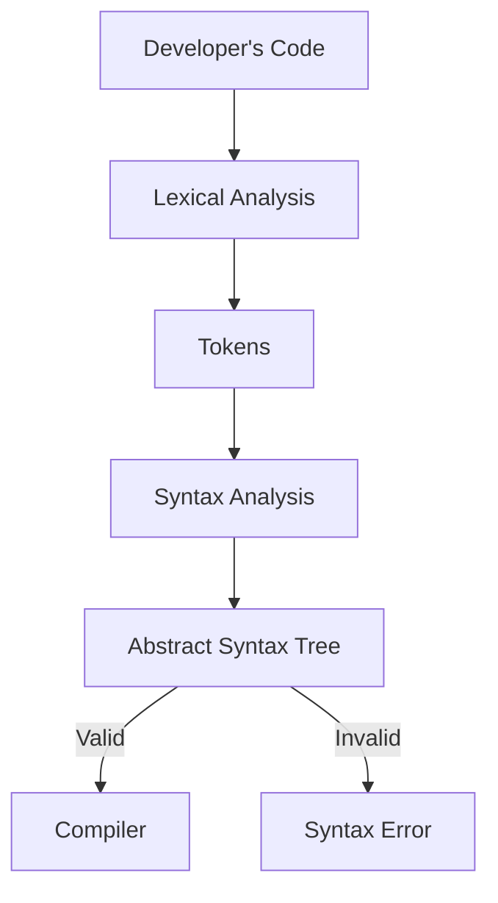
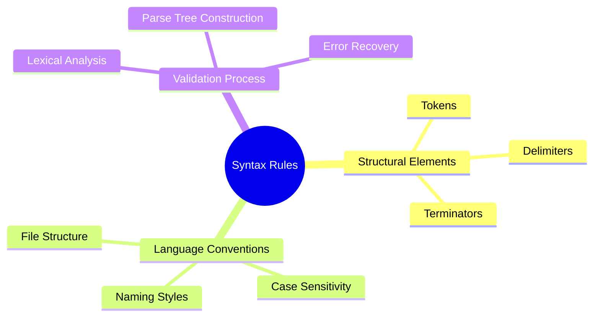
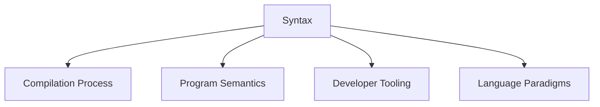

# language_Syntax

**Concept Type**:: #
**Mastery Level**:: `🧠 Familiar `
**Date Started**:: 2025-05-31
**Last Revised**::
**Related**:: [[Control_Structures|control_Structures]]
**Tags**:: #fundamentals #DataStructure #syntax

## Core Concept

> Formal rules governing code structure in programming languages, defining valid symbol arrangements that compilers/interpreters can process.
> Syntax provides the structural framework for expressing program semantics.

## Why Important?

- Enables machines to interpret human-written code
- Prevents ambiguous code interpretations
- Standardizes communication between developers
- Mandatory for successful code compilation/execution
- Foundation for language tooling (linters, formatters)

## How It Works

Syntax rules form a language's grammatical structure:



````

## Core Mechanics

```javascript
// BASIC SYNTAX ELEMENTS
// Case sensitivity (JavaScript)
const myVar = 10;  // Valid
console.log(myvar); // Error: myvar undefined

// Naming conventions (Python class)
class MyClass:   # PascalCase
    def my_method(self):  # snake_case
        pass

// File naming (Java)
// File: MyClass.java
public class MyClass {}  // Must match filename

// Terminators (C vs Python)
int x = 5;  // Semicolon required (C)
x = 5       // Newline as terminator (Python)
```

### Key Components

- **Tokens**: Smallest meaningful units (keywords, operators)
- **Delimiters**: Characters defining code boundaries ({ }, ( ), ;)
- **Whitespace**: Significant in Python, ignored in JavaScript
- **Comments**: // Single-line, /_ Multi-line _/

## Practical Examples

### Basic Usage

```python
# Valid Python syntax
def greet(name: str) -> str:
    """Return greeting message"""
    return f"Hello, {name}!"

# Invalid (missing colon)
def greet(name)  # SyntaxError: expected ':'
```

### Real-World Scenario

```java
// Enterprise Java class
public class PaymentProcessor {  // PascalCase class name

    // camelCase method name
    public void processPayment(BigDecimal amount) {
        if (amount.compareTo(BigDecimal.ZERO) > 0) {
            executeTransaction(amount);
        } else {
            throw new InvalidPaymentException();
        }
    }  // Braces define block boundaries
}
```

## Common Pitfalls

```javascript
// Case sensitivity error
const adminRole = "Administrator";
console.log(AdminRole); // ReferenceError: AdminRole undefined

// Missing terminator
function calculateTotal() {
    const subtotal = 100
    return subtotal * 1.08 // Automatic Semicolon Insertion fails
}

🛑 **Why to Avoid:**
- Breaks compilation/interpretation
- Creates subtle bugs in ASI languages
- Causes inconsistent behavior across environments
- Violates language specifications
```

## Mental Models



## Practice Exercises

```python
# BASIC: Fix syntax errors
def sum_numbers(a, b)
    return a + b

print(sum_numbers(5, 10))

# INTERMEDIATE: Implement Python class
class BankAccount:
    def __init__(self, account_id, balance=0):
        # Initialize attributes
        pass

    def deposit(self, amount):
        # Add validation
        pass
```

## Concept Connections



## Recall Triggers

- **Mnemonic**: "CTRL-S Code" (Conventions, Tokens, Rules, Layout, Structure)
- **Visualization**: Grammar parse tree with branches for different syntax elements
- **Analogy**: Building codes for architecture (syntax = building regulations, program = structure)

## Resources

1. [Python Syntax Documentation](https://docs.python.org/3/reference/grammar.html)
2. [ECMAScript Language Specification](https://262.ecma-international.org/)
3. [Syntax Visualizer Extension](https://marketplace.visualstudio.com/items?itemName=ms-vscode.vscode-js-profile-flame)
4. [Interactive Syntax Playground](https://astexplorer.net/)

```

```
````
